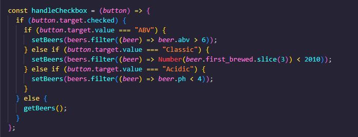

<p align="center">
  <a href="" rel="noopener">
 </a>
</p>

<h3 align="center">Fancy A Brew?</h3>

<div align="center">

[]()

</div>

---

<p align="center"> This project runs the Punk Api to present beer cards with descriptions of each beer. You can also filter through the ABV, Ph level and a Classic Range. When you click the image of the beer, it will take you to another page with more information in that perticular beer. 
    <br> 
</p>

## 📝 Table of Contents

- [About](#about)
- [Getting Started](#getting_started)
- [Usage](#usage)
- [Built Using](#built_using)
- [TODO](../TODO.md)
- [Contributing](../CONTRIBUTING.md)
- [Authors](#authors)
- [Acknowledgments](#acknowledgement)

## 🧐 About <a name = "about"></a>

This project was creating to advance my react skills and ability to produce a professional looking webpage, using an API. The focus on this project was using an API and functionality. Using JavaScript to write each function that will sort through the value of keys in the API.

For a user they are able to search through the beers cards for a perticular beer in the list. They can also use the filter feature to make the list only show what fits the criteria of each of these filters. All the filters can be used at the same time to customise the list of beers presented.

## 🏁 Getting Started <a name = "getting_started"></a>

To start this project I wanted to make sure that all of the functionality works. Having the basic styling so that I could see what is happening as I updated each line of code.
Creating the cards was first using a simple data base, before implementing the API information. Using JavaScript to create the functions, i worked on creating a search function so that users can search through the list of beers.

Props have allowed for these functions to be sent down to components so that they are presentational and testable for the users. The filter functions run through If statements to tell the data what should functions should be run through to present the right information.

<p align="left">
  <a href="" rel="noopener">
 </a>
</p>
## 🔧 Running the tests <a name = "tests"></a>

Tests are being run on the Card component and the FilterItems component. These tests are checking that these components are being rendered, everything else that should be showing up.

The test below is testing the the component itself is rending on the document.

```
it("should it renders a card", async() => {
    render(<Card />);

    const cards = screen.queryAllByRole("card");

    cards.forEach(card => {expect(card).toBeInTheDocument();})
});
```

## 🎈 Usage <a name="usage"></a>

This is using React, and can be used to present information cards from an api database.
With small changes you could present any time of cards, making sure to read the API documentation to make the correct changes.

## ⛏️ Built Using <a name = "built_using"></a>

- [JavaScript](https://www.javascript.com/) - Code Language
- [React](https://reactjs.org/) - Web Framework
- [Punk Api](https://punkapi.com/documentation/v2) - API database

## ✍️ Authors <a name = "authors"></a>

- [@BrookeVerse](https://github.com/BrookeVerse) - Developed By

## 🎉 Acknowledgements <a name = "acknowledgement"></a>

The \_nology coaches who trained us in using react, so that we could use that knowledge to create an app from scratch.

<p align="center">
  <a href="" rel="noopener">
 </a>
</p>
